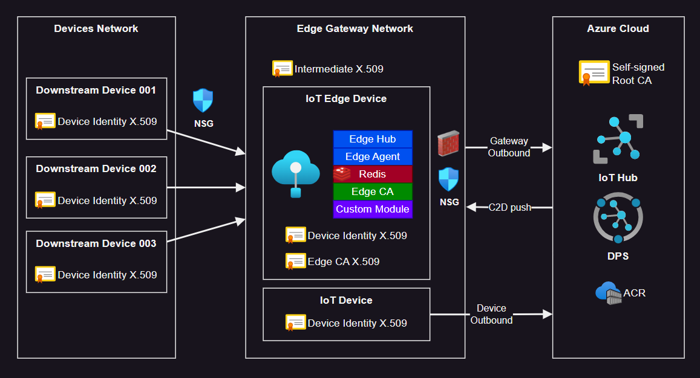

# Azure IoT Solution

A complete solution combining all several Azure IoT features and products:



> ℹ️ All commands should be run from the project root

## Cloud IoT

### 1 - Create the certificates

Start by creating the required certificates:

```sh
bash scripts/generateCerts.sh
```

### 2 - Create the Azure resources

Create the infrastructure:

```sh
terraform -chdir="infrastructure" init
terraform -chdir="infrastructure" apply -auto-approve
```

Run the extra configuration not available via Terraform:

```sh
bash scripts/terraformExtra.sh
```

Change the hostname of the IoT Edge OS to `edgegateway` to match the certificates:

> IoT Edge requires it to be exact or have the first component in the FQDN
>
> Reboot is required

```sh
# Change to: edgegateway.fusiontech.iot
sudo nano /etc/hostname
```

Restart the VM: `az vm restart -g rg-fusiontech -n vm-fusiontech-edgegateway`

> ⚠️ After changing the hostname, need to add a manual DNS registry: `edgegateway.fusiontech.iot A 10.0.90.4`. I should find a fix for this if I have time.

```sh
az network private-dns record-set a add-record -g rg-fusiontech -z fusiontech.iot -n edgegateway.fusiontech.iot -a "10.0.90.4"
```

(Optional) Verify the cloud-init completion:

```sh
# Connect to the IoT Edge VM
ssh edgegateway@<public-ip>
ssh downstream@<public-ip>

# Check if the cloud-init status is "done", otherwise wait with "--wait"
cloud-init status

# Confirm that the IoT Edge runtime has been installed
iotedge --version

# Restart the VM to enable any Kernel updates
az vm restart -n "vm-fusiontech-edgegateway" -g "rg-fusiontech"
az vm restart -n "vm-fusiontech-downstream001" -g "rg-fusiontech"
```

### 3 - Configure the IoT Edge device

Run the configuration script locally:

```sh
# Run locally
bash scripts/uploadEdgeConfig.sh
```

This will copy the prepared files to the IoT Edge device VM.

Now, in the remote VM shell, run the installation script:

```sh
# Run remotely in the Azure VM shell
sudo bash edgeconfig.sh
```

Confirm that the IoT Edge runtime has been installed:

```sh
sudo iotedge system logs

# Add --iothub-hostname if using DPS to also test for IoT Hub
sudo iotedge check --iothub-hostname iot-fusiontech.azure-devices.net
```

### 4 - Deploy Modules

Create the deployment "RedisEdge":

```sh
az iot edge deployment create --deployment-id "gateway" \
    --hub-name $(jq -r .iothub_name infrastructure/output.json) \
    --content "@iotedge/deployments/gateway.json" \
    --labels '{"Release":"001"}' \
    --target-condition "tags.Environment='Staging'" \
    --priority 10
```

Check the portal and the IoT device:

```sh
# List the modules in the Azure VM
iotedge list
```

### 5 - Provision downstream devices

Upload the configuration:

```sh
bash scripts/uploadDownstreamDeviceConfig.sh
```

Register the downstream device:

```sh
# Get the IoT Edge Gateway device scope
az iot hub device-identity show --device-id "edgegateway.fusiontech.iot" --hub-name $(jq -r .iothub_name infrastructure/output.json) --query deviceScope -o tsv

# Create the downstream device identity
az iot hub device-identity create -n $(jq -r .iothub_name infrastructure/output.json) \
    -d "downstream-device-01.fusiontech.iot" \
    --device-scope "{deviceScope of gateway device}" \
    --am x509_ca
```

Verify the connectivity:

```sh
openssl s_client -connect edgegateway.fusiontech.iot:8883 -CAfile azure-iot-test-only.root.ca.cert.pem -showcerts
```

Run the downstream device code:

```sh
python3 downstream.py
```

### 6 - Deploy a custom module

Get the credentials for the ACR:

```
az acr credential show --name acriotedgefusion789
```

Login to docker:

```
docker login -u acriotedgefusion789 -p <ACR password> acriotedgefusion789.azurecr.io
```

Login do ACR:

```
az acr login -n acriotedgefusion789
```

Create a copy of the deployment configuration:

```
cp ./iotedgesolution/deployment.template.json ./iotedgesolution/deployment.json
```

Change the `myacr` password placeholder `<PASSWORD>` in the deployment template.

Build the image:

```sh
# Build the image for the local registry
docker build --rm -f "./iotedgesolution/modules/filtermodule/Dockerfile.amd64.debug" -t localhost:5000/filtermodule:0.0.1-amd64 "./iotedgesolution/modules/filtermodule"

# Or build the image for an Azure Container Registry
docker build --rm -f "./iotedgesolution//modules/filtermodule/Dockerfile.amd64" -t acriotedgefusion789.azurecr.io/filtermodule:0.0.1-amd64 "./iotedgesolution/modules/filtermodule"
```

Push the image to ACR:

```
docker push acriotedgefusion789.azurecr.io/filtermodule:0.0.1-amd64
```

Deploy the custom module:

```sh
az iot edge deployment create --deployment-id "new-custom-module" \
    --hub-name $(jq -r .iothub_name infrastructure/output.json) \
    --content "@iotedgesolution/deployment.json" \
    --labels '{"Release":"001"}' \
    --target-condition "tags.Environment='Staging'" \
    --priority 10
```

## Python development

### Local Python

```
cd device
```

Create the local development device certificates:

```sh
bash generateDevCerts.sh
```

Create the `.env` and edit the `PROVISIONING_IDSCOPE` variable:

```sh
cp .example.env .env
```

Install and run the device:

```sh
pipenv install --dev
pipenv shell
python device.py
```

### Docker

```sh
docker build . -t iothub-pydevice:latest
```

```sh
docker run --rm iothub-pydevice:latest arg1 arg2
```

## Reference

- [GitHub IoT Edge - IoT Edge VM Deploy](https://github.com/Azure/iotedge-vm-deploy)
- [Azure DPS - Device OEM Security Practices](https://learn.microsoft.com/en-us/azure/iot-dps/concepts-device-oem-security-practices)
- [Azure DPS - How to roll devices](https://learn.microsoft.com/en-us/azure/iot-dps/how-to-roll-certificates)
- [AWS - HSM](https://aws.amazon.com/blogs/iot/enhancing-iot-device-security-using-hardware-security-modules-and-aws-iot-device-sdk/)
- [Azure - EST](https://learn.microsoft.com/en-us/azure/iot-edge/tutorial-configure-est-server?view=iotedge-1.4)
